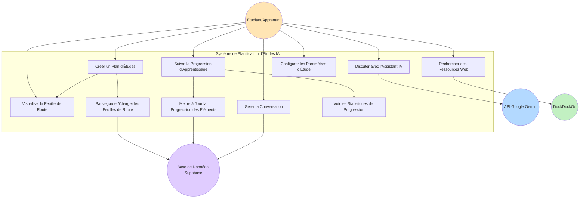
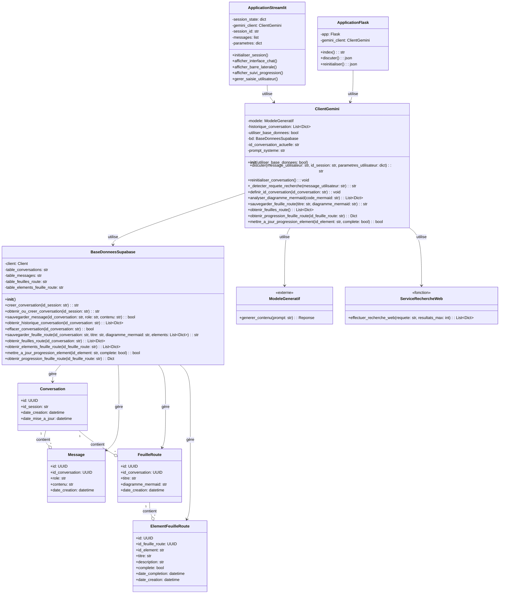
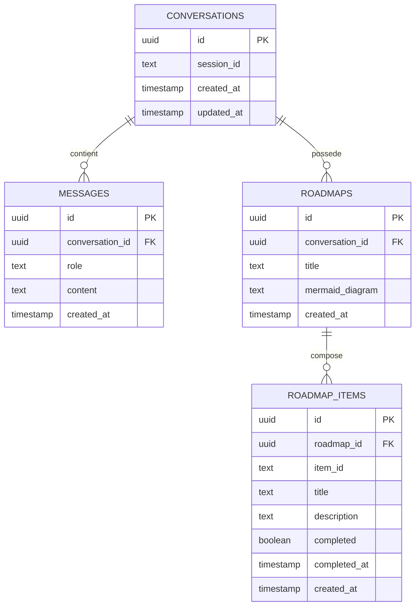

# Architecture du Système - Planificateur d'Études IA

Ce document décrit l'architecture complète du système de planification d'études propulsé par l'IA, incluant les diagrammes UML et les modèles de conception utilisés.

## Table des Matières
1. [Vue d'Ensemble](#vue-densemble)
2. [Diagramme de Cas d'Utilisation](#diagramme-de-cas-dutilisation)
3. [Diagramme de Classes](#diagramme-de-classes)
4. [Architecture et Modèles de Conception](#architecture-et-modèles-de-conception)
5. [Schéma de Base de Données](#schéma-de-base-de-données)

---

## Vue d'Ensemble

Le Planificateur d'Études IA est une application web qui aide les étudiants à créer des plans d'études personnalisés en utilisant l'intelligence artificielle (Google Gemini). Le système offre : 

- **Planification intelligente** : Génération de plans d'études personnalisés
- **Visualisation** : Feuilles de route visuelles avec diagrammes Mermaid
- **Suivi de progression** : Système de suivi avec cases à cocher
- **Recherche web** : Intégration de DuckDuckGo pour trouver des ressources
- **Persistance** : Sauvegarde des conversations et feuilles de route dans Supabase

---

## Diagramme de Cas d'Utilisation

### Description Globale



### Cas d'Utilisation Détaillés

#### UC1 : Créer un Plan d'Études
- **Acteur** : Étudiant/Apprenant
- **Description** : L'utilisateur demande un plan d'études personnalisé avec des objectifs, durée et niveau spécifiques
- **Préconditions** : L'utilisateur a configuré ses paramètres d'étude
- **Postconditions** : Un plan d'études avec feuille de route est généré et affiché

#### UC2 :  Discuter avec l'Assistant IA
- **Acteur** : Étudiant/Apprenant
- **Description** :  Conversation interactive avec l'IA pour des conseils d'apprentissage
- **Préconditions** : L'application est initialisée
- **Postconditions** :  L'utilisateur reçoit une réponse contextuelle de l'IA

#### UC3 : Rechercher des Ressources Web
- **Acteur** : Étudiant/Apprenant
- **Description** : Trouver des ressources d'apprentissage en ligne via la recherche web
- **Préconditions** : L'utilisateur utilise le préfixe "search:" ou "/search"
- **Postconditions** : Des résultats de recherche pertinents sont affichés avec citations

#### UC4 : Visualiser la Feuille de Route
- **Acteur** :  Étudiant/Apprenant
- **Description** :  Visualiser le parcours d'apprentissage avec des diagrammes Mermaid
- **Préconditions** :  Un plan d'études a été généré
- **Postconditions** : Un diagramme visuel de la feuille de route est affiché

#### UC5 : Suivre la Progression d'Apprentissage
- **Acteur** : Étudiant/Apprenant
- **Description** : Surveiller l'achèvement des éléments de la feuille de route
- **Préconditions** : Une feuille de route a été sauvegardée
- **Postconditions** : La progression est affichée avec statistiques

#### UC6 : Gérer la Conversation
- **Acteur** : Étudiant/Apprenant
- **Description** : Réinitialiser ou continuer les conversations précédentes
- **Préconditions** : L'application est active
- **Postconditions** : La conversation est réinitialisée ou restaurée

#### UC7 :  Configurer les Paramètres d'Étude
- **Acteur** : Étudiant/Apprenant
- **Description** : Définir la durée, le niveau et les préférences du domaine d'étude
- **Préconditions** : L'utilisateur accède à la barre latérale
- **Postconditions** : Les paramètres sont sauvegardés dans l'état de session

#### UC8 : Sauvegarder/Charger les Feuilles de Route
- **Acteur** :  Système
- **Description** : Persister les feuilles de route dans la base de données
- **Préconditions** : La base de données est connectée
- **Postconditions** : Les données sont sauvegardées ou récupérées

#### UC9 : Mettre à Jour la Progression des Éléments
- **Acteur** :  Étudiant/Apprenant
- **Description** : Marquer les éléments comme complets/incomplets
- **Préconditions** : L'utilisateur visualise une feuille de route
- **Postconditions** : L'état de complétion est mis à jour dans la BD

#### UC10 : Voir les Statistiques de Progression
- **Acteur** :  Étudiant/Apprenant
- **Description** : Consulter les métriques et pourcentages d'achèvement
- **Préconditions** : Une feuille de route avec éléments existe
- **Postconditions** :  Statistiques affichées (total, complétés, pourcentage)

---

## Diagramme de Classes

### Vue d'Ensemble de l'Architecture



### Description des Classes Principales

#### ApplicationStreamlit
Interface utilisateur principale construite avec Streamlit. Gère l'état de session, affiche l'interface de chat, la barre latérale de configuration et le suivi de progression. 

#### ClientGemini
Contrôleur principal qui gère la logique métier.  Communique avec l'API Gemini, détecte les requêtes de recherche, gère l'historique des conversations et coordonne la sauvegarde des données.

#### BaseDonneesSupabase
Couche d'accès aux données qui abstrait toutes les opérations de base de données. Implémente le pattern Repository pour gérer les conversations, messages, feuilles de route et éléments. 

#### ApplicationFlask
Application web alternative utilisant Flask (backend/app.py). Fournit les mêmes fonctionnalités via une API REST. 

#### Entités de Base de Données
- **Conversation** : Représente une session de conversation
- **Message** :  Message individuel (utilisateur ou assistant)
- **FeuilleRoute** : Plan d'études avec diagramme Mermaid
- **ElementFeuilleRoute** : Élément individuel d'une feuille de route

---

## Architecture et Modèles de Conception

### Modèle Architectural :  MVC (Modèle-Vue-Contrôleur)

```
┌─────────────────────────────────────────────────────┐
│                      VUE                             │
│  ApplicationStreamlit / ApplicationFlask             │
│  (Interface utilisateur et templates)                │
└─────────────────────────────────────────────────────┘
                        │
                        ▼
┌─────────────────────────────────────────────────────┐
│                  CONTRÔLEUR                          │
│                ClientGemini                          │
│  (Logique métier, orchestration)                     │
└─────────────────────────────────────────────────────┘
                        │
                        ▼
┌─────────────────────────────────────────────────────┐
│                    MODÈLE                            │
│  BaseDonneesSupabase + Entités de BD                 │
│  (Accès aux données, persistance)                    │
└─────────────────────────────────────────────────────┘
```

### Modèles de Conception Utilisés

#### 1. Singleton Pattern
- **Utilisation** : Instance `ClientGemini` dans l'état de session Streamlit
- **Avantage** : Une seule instance par session utilisateur, économie de ressources

#### 2. Repository Pattern
- **Utilisation** : Classe `BaseDonneesSupabase`
- **Avantage** : Abstraction complète des opérations de base de données, facilite les tests

#### 3. Factory Pattern
- **Utilisation** : Méthode `get_or_create_conversation()`
- **Avantage** : Création conditionnelle d'objets selon l'existence

#### 4. Strategy Pattern
- **Utilisation** : Détection et traitement des recherches web (`_detecter_requete_recherche()`)
- **Avantage** : Comportement flexible selon le type de message

#### 5. Template Method Pattern
- **Utilisation** : Méthode `chat()` qui suit un algorithme défini
- **Avantage** : Structure cohérente du traitement des messages

### Relations entre Classes

#### Composition
- `ClientGemini` **contient** `BaseDonneesSupabase`
- La base de données ne peut exister sans le client

#### Agrégation
- `Conversation` **possède** plusieurs `Messages`
- `Conversation` **possède** plusieurs `FeuilleRoute`
- Les entités peuvent exister indépendamment

#### Association
- `ClientGemini` **utilise** `ModeleGeneratif` (API externe)
- `ClientGemini` **utilise** `ServiceRechercheWeb` (fonction utilitaire)

---

## Schéma de Base de Données

### Diagramme Entité-Relation



### Tables et Relations

#### Table :  conversations
Stocke les sessions de conversation des utilisateurs.

| Colonne | Type | Description |
|---------|------|-------------|
| id | UUID | Clé primaire |
| session_id | TEXT | Identifiant de session unique |
| created_at | TIMESTAMP | Date de création |
| updated_at | TIMESTAMP | Date de dernière modification |

**Index** : `idx_conversations_session_id` sur `session_id`

#### Table : messages
Stocke tous les messages échangés dans les conversations.

| Colonne | Type | Description |
|---------|------|-------------|
| id | UUID | Clé primaire |
| conversation_id | UUID | Clé étrangère vers conversations |
| role | TEXT | 'user' ou 'assistant' |
| content | TEXT | Contenu du message |
| created_at | TIMESTAMP | Date de création |

**Contraintes** :  
- `role` doit être 'user' ou 'assistant'
- Suppression en cascade si conversation supprimée

**Index** : 
- `idx_messages_conversation_id` sur `conversation_id`
- `idx_messages_created_at` sur `created_at`

#### Table : roadmaps
Stocke les feuilles de route générées avec leurs diagrammes Mermaid. 

| Colonne | Type | Description |
|---------|------|-------------|
| id | UUID | Clé primaire |
| conversation_id | UUID | Clé étrangère vers conversations |
| title | TEXT | Titre de la feuille de route |
| mermaid_diagram | TEXT | Code Mermaid du diagramme |
| created_at | TIMESTAMP | Date de création |

**Index** : `idx_roadmaps_conversation_id` sur `conversation_id`

#### Table : roadmap_items
Stocke les éléments individuels de chaque feuille de route pour le suivi de progression.

| Colonne | Type | Description |
|---------|------|-------------|
| id | UUID | Clé primaire |
| roadmap_id | UUID | Clé étrangère vers roadmaps |
| item_id | TEXT | ID du nœud (A, B, C, etc.) |
| title | TEXT | Titre de l'élément |
| description | TEXT | Description de l'élément |
| completed | BOOLEAN | État de complétion |
| completed_at | TIMESTAMP | Date de complétion |
| created_at | TIMESTAMP | Date de création |

**Contraintes** :
- Paire unique `(roadmap_id, item_id)`
- Suppression en cascade si feuille de route supprimée

**Index** : `idx_roadmap_items_roadmap_id` sur `roadmap_id`

### Sécurité :  Row Level Security (RLS)

Toutes les tables ont RLS activé avec des politiques permissives pour le développement.  **Important** : Adapter les politiques pour la production avec authentification utilisateur.

---

## Flux de Données Principaux

### 1. Création d'un Plan d'Études

```
Utilisateur → ApplicationStreamlit → ClientGemini
                                           ↓
                                    ModeleGeneratif (Gemini API)
                                           ↓
                                    Analyse de la réponse
                                           ↓
                                    Extraction diagramme Mermaid
                                           ↓
                                    BaseDonneesSupabase
                                           ↓
                                    Sauvegarde (roadmaps + roadmap_items)
                                           ↓
                                    Affichage à l'utilisateur
```

### 2. Recherche Web

```
Utilisateur (message avec "search: ") → ClientGemini
                                            ↓
                                    _detecter_requete_recherche()
                                            ↓
                                    ServiceRechercheWeb (DuckDuckGo)
                                            ↓
                                    Formatage des résultats
                                            ↓
                                    ModeleGeneratif (synthèse)
                                            ↓
                                    Réponse avec citations
```

### 3. Suivi de Progression

```
Utilisateur (coche case) → ApplicationStreamlit
                                    ↓
                            update_item_progress()
                                    ↓
                            BaseDonneesSupabase
                                    ↓
                            Mise à jour BD (completed = true)
                                    ↓
                            Recalcul statistiques
                                    ↓
                            Affichage progression mise à jour
```

---

## Technologies Utilisées

### Frontend
- **Streamlit** :  Framework d'interface utilisateur
- **streamlit-mermaid** : Rendu des diagrammes Mermaid

### Backend
- **Flask** :  Framework web alternatif (backend/app.py)
- **Python 3.7+** : Langage principal

### Intelligence Artificielle
- **Google Gemini API** : Modèle génératif (gemini-2.5-flash)
- **DuckDuckGo Search** :  Recherche web

### Base de Données
- **Supabase** : PostgreSQL hébergé avec API REST
- **PostgreSQL** : Base de données relationnelle

### Bibliothèques Python
- `google-generativeai` : SDK Gemini
- `supabase` : Client Python Supabase
- `duckduckgo-search` : API de recherche
- `python-dotenv` : Gestion variables d'environnement

---

## Conclusion

Cette architecture modulaire permet : 
- ✅ Séparation claire des responsabilités (MVC)
- ✅ Facilité de maintenance et tests
- ✅ Extensibilité (ajout de nouvelles fonctionnalités)
- ✅ Persistance des données avec Supabase
- ✅ Intégration flexible d'APIs externes
- ✅ Interface utilisateur réactive avec Streamlit

Pour plus d'informations sur l'utilisation, consultez le [README. md](../README.md).
